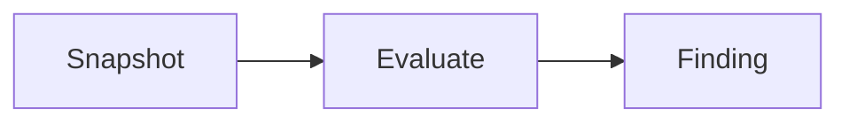

# Blog Instructions — systeminvariant.dev

Everything you need to write, format, and publish a blog post on the
Docusaurus site served at systeminvariant.dev.

## Voice and Tone

**Core principle**: Deterministic, not dramatic. Precise, not paranoid.

| Say | Never Say |
|-----|-----------|
| Risk Reasoning Engine | scanner |
| invariant | rule, check |
| finding | alert, violation |
| inspectable | (omit — but this is the sharpest differentiator) |

**Positioning tagline**: Deterministic. Traceable. Inspectable.

**Copy rules**: facts, numbers, plain language, short sentences. No
marketing adjectives, no "platform", no "AI", no "innovation." Security
leaders trust evidence, not claims.

Full vocabulary and positioning detail: [`content/voice-and-tone.md`](../content/voice-and-tone.md).

## Article Structure

Every security research article follows this structure:

1. **What happened** — the actual incident, from the actual report
2. **Why the infrastructure configuration made it possible**
3. **The System Invariant that was false**
4. **The control that detects it** — with the predicate visible
5. **The E2E test that proves it** — with the snapshot structure shown
6. **The remediation**

The tests come first. The articles are just making the tests legible to
humans. Each article is simultaneously a case study, a control doc, a test
doc, and a proof that detection is not theoretical.

Full pipeline from HackerOne report to published article:
[`channels/article-workflow.md`](../channels/article-workflow.md).

**Length**: 800–1200 words, practical, no fluff.

**Don't pitch**: every post should be interesting even if Stave didn't
exist. If you have to say "check out my tool" in the post, the post
isn't good enough.

## File Location

Blog posts live in `site/blog/`. Two formats:

```
site/blog/
  2026-03-01-my-post.md                  # text-only post
  2026-02-16-introducing-stave/          # post with images
    index.md
    arch-diagram.png
```

Use the directory form when a post has images. Use the flat file for
text-only posts.

## Frontmatter

Every post starts with YAML frontmatter:

```yaml
---
slug: introducing-stave
title: "Introducing Stave: Configuration Safety for S3"
authors: [sufield]
tags: [release, s3, security]
date: 2026-02-16
---
```

| Field | Required | Description |
|-------|----------|-------------|
| `title` | yes | Page heading and blog sidebar title. |
| `authors` | yes | Array of author keys from `blog/authors.yml`. |
| `slug` | no | URL path (`/blog/introducing-stave`). Defaults to filename. |
| `tags` | no | For filtering. Generates `/blog/tags/<tag>` pages. |
| `date` | no | Publish date. Defaults to the `YYYY-MM-DD-` filename prefix. |
| `description` | no | Meta tags and blog list summary. |
| `image` | no | Social sharing image (relative path or URL). |
| `hide_table_of_contents` | no | Set `true` to suppress the right-hand TOC. |

## Authors and Tags

Define authors in `site/blog/authors.yml`:

```yaml
sufield:
  name: Bala Paranj
  url: https://github.com/sufield
  image_url: https://github.com/sufield.png
```

Define tags in `site/blog/tags.yml`:

```yaml
stave:
  label: Stave
  description: Posts about Stave CLI
```

## Truncate Marker

Everything above `<!-- truncate -->` appears as the preview on the blog
list page. Everything below appears only on the full post:

```markdown
---
title: "Why S3 Buckets Stay Public for 240 Hours"
authors: [sufield]
tags: [s3, hackerone]
---

Most S3 exposure incidents persist because no one checks the duration.

<!-- truncate -->

## The 240-hour pattern

In HackerOne #361438, the bucket was publicly readable for over 240 hours...
```

## Syntax Highlighting

Fenced code blocks with a language tag:

````markdown
```json
{ "schema_version": "obs.v0.1" }
```
````

Relevant language tags: `json`, `yaml`, `bash`, `hcl`, `go`,
`ts`/`typescript`, `tsx`, `markdown`, `lisp` (for SMT-LIB/Z3).

### Line Highlighting

```markdown
// highlight-next-line
```

Or a range in the meta string:

````markdown
```json {3-5}
````

### Code Block Titles

````markdown
```yaml title="CTL.S3.PUBLIC.001.yaml"
````

## Admonitions

```markdown
:::note
Stave needs at least two snapshots for duration-based controls.
:::

:::warning
Missing fields do **not** match `eq false`.
:::

:::tip
Run `stave validate` before `apply` to catch input errors early.
:::

:::danger
Never commit raw AWS API responses containing account IDs to a public repo.
:::
```

## Images

Place images next to the post's `index.md` and reference with a relative
path:

```markdown

```

## MDX: React Components in Posts

Use the `.mdx` extension for posts that import React components. Plain
`.md` works for pure markdown.

### Terminal Recordings

```mdx
import AsciinemaPlayer from '@site/src/components/AsciinemaPlayer';

<AsciinemaPlayer src="/recordings/h1-uber-361438.cast" speed={1.5} />
```

### Tabs

```mdx
import Tabs from '@theme/Tabs';
import TabItem from '@theme/TabItem';

<Tabs>
  <TabItem value="json" label="JSON output" default>

    ```json
    { "summary": { "violations": 2 } }
    ```

  </TabItem>
  <TabItem value="text" label="Text output">

    ```
    Violations: 2, Attack surface: 1
    ```

  </TabItem>
</Tabs>
```

## Mermaid Diagrams

Mermaid is supported via `@docusaurus/theme-mermaid`. Use fenced blocks
with the `mermaid` language tag:

````markdown

````

## Publishing Pipeline

All commands run from the repo root (`/home/zepho/work/bizacademy`)
unless noted.

| Step | Command | What it does |
|------|---------|--------------|
| 1. Regen docs | `make -C stave sync-guide && make -C stave docs-site` | Control catalog + CLI reference → stave-guide |
| 2. Build site | `cd site && npm run build && cd ..` | Static output → `site/build/` (fails on broken links) |
| 3. Mirror | `make sync-docs` | Rsync `site/build/` → `/home/zepho/work/systeminvariant.dev` |
| 4. Publish | `cd /home/zepho/work/systeminvariant.dev && git add -A && git commit -m "docs: rebuild site" && git push` | GitHub Pages serves systeminvariant.dev |

For local preview: `cd site && npm start` (dev server at localhost:3000)
or `cd site && npm run serve` (serve the built output).

Full pipeline detail: [`readme-guide.md`](../readme-guide.md).

## Content Strategy References

These documents cover the broader content strategy. Read them for context;
this file covers the mechanics.

| Document | What it covers |
|----------|---------------|
| [`channels/playbook.md`](../channels/playbook.md) | Content flywheel, channel strategy, SEO approach |
| [`channels/stave-manifesto.md`](../channels/stave-manifesto.md) | Nine doctrine principles governing all content |
| [`content/content-calendar.md`](../content/content-calendar.md) | Phased rollout plan |
| [`channels/devto/sequence.md`](../channels/devto/sequence.md) | Publishing order and dependency graph |
| [`channels/devto/master-index.md`](../channels/devto/master-index.md) | 55-article reading guide with URL structure |
| [`channels/episode-structure.md`](../channels/episode-structure.md) | Video/screencast format (silent, 4-6 min) |

## Key Notes

- RSS/Atom feeds auto-generated at `/blog/rss.xml` and `/blog/atom.xml`.
- Blog sidebar shows up to 10 recent posts (configured in `docusaurus.config.ts`).
- Markdown format is `"detect"`: `.md` = CommonMark, `.mdx` = MDX with JSX.
- Local search is provided by `@easyops-cn/docusaurus-search-local`.
- Default color mode is dark, with `respectPrefersColorScheme` enabled.
