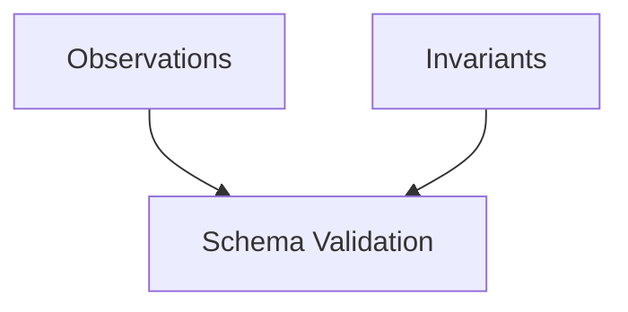
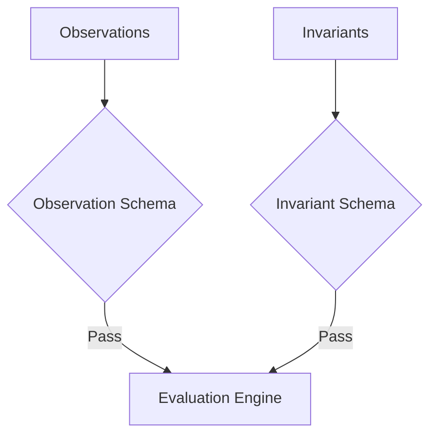
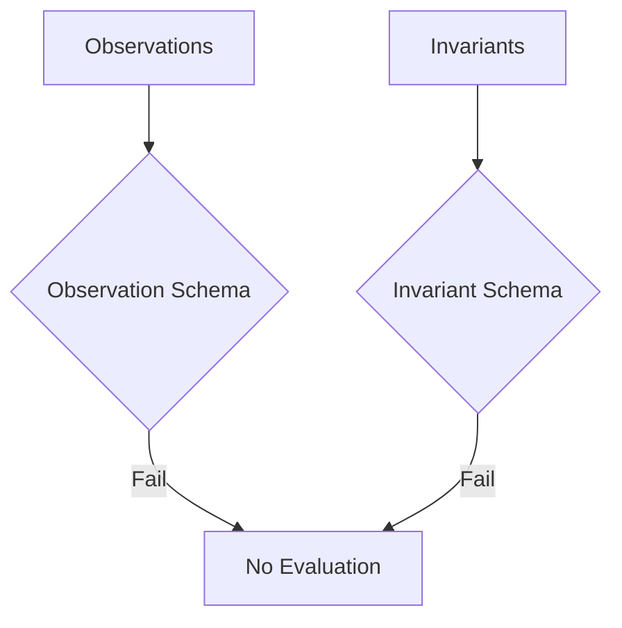
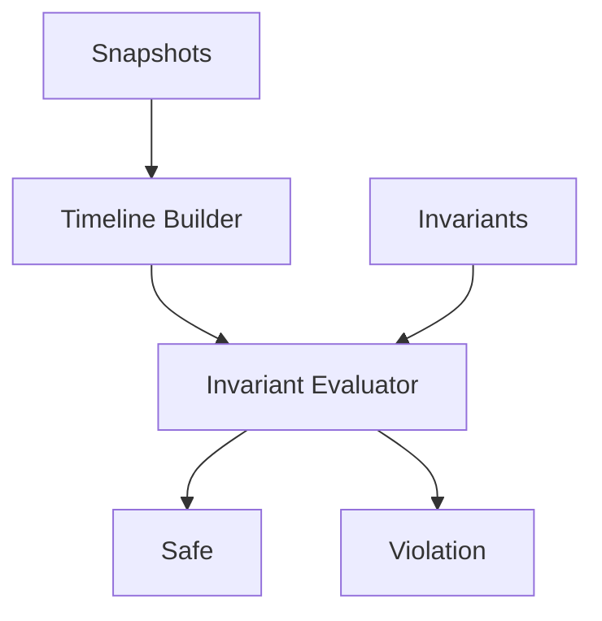
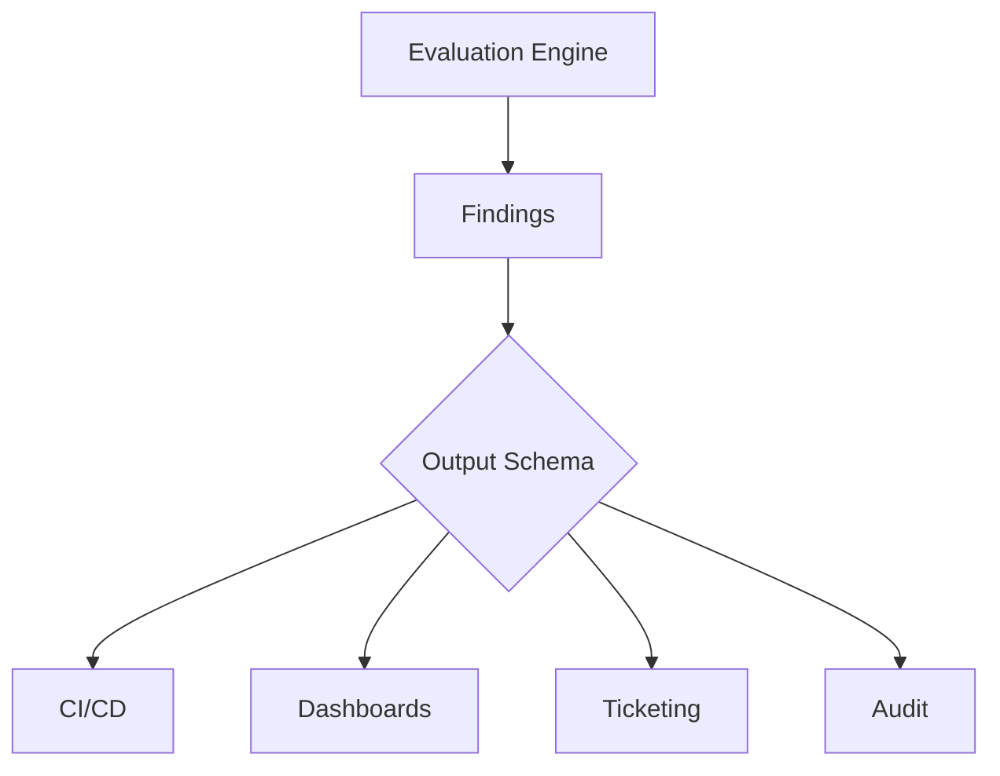

# How Stave Works

Stave is a pipeline with four stages: inputs, schema validation, evaluation, and structured output. Each stage is shown below.

## 1. Inputs

Two inputs feed the pipeline — observation snapshots captured from your infrastructure, and invariant definitions that encode your safety policies.



Each observation file is a flat JSON snapshot of your infrastructure at a specific point in time. Each invariant is a YAML file defining a safety property that must hold true. Stave ships with 43 S3 invariants, and you can write your own.

## 2. Schema Validation

Both inputs are validated against embedded JSON Schema (Draft 2020-12) before evaluation begins. If validation fails, Stave exits with code `2` and no evaluation runs.

**Valid inputs proceed to evaluation:**



**Invalid inputs halt the pipeline:**



```bash
# Validate inputs before evaluation
stave validate --invariants ./invariants --observations ./observations
```

## 3. Evaluation

After validation, the engine builds a timeline for each resource across all snapshots, then evaluates every invariant against every resource.



| Type | Behavior |
|------|----------|
| `unsafe_state` | Violation if the resource is attack surface |
| `unsafe_duration` | Violation if the resource has been continuously unsafe longer than `--max-unsafe` |
| `unsafe_recurrence` | Violation if the resource has toggled unsafe repeatedly |
| `prefix_exposure` | Violation if protected S3 prefixes are publicly readable |

## 4. Output

Stave's output conforms to the `out.v0.1` schema, enforced at the Go type level. The output is structured JSON designed for machine consumption by downstream systems — CI/CD pipelines, dashboards, ticketing integrations, and audit tools.



The output schema guarantees:

- A `run` object with tool version, `--eval-time` timestamp, snapshot count, and deterministic input hashes
- A `summary` with `resources_evaluated`, `attack_surface`, and `violations` counts
- A `findings` array where each finding includes `invariant_id`, `resource_id`, `evidence`, and `mitigation`
- Deterministic output: same inputs with `--eval-time` always produce byte-for-byte identical JSON

```bash
# Evaluate and pipe to downstream tools
stave apply \
  --invariants invariants/s3 \
  --observations ./observations \
  --max-unsafe 7d \
  --eval-time 2026-01-15T00:00:00Z \
  | jq '.findings[] | select(.severity == "critical")'
```

## Schema Locations

| Schema | Format | Location |
|--------|--------|----------|
| `obs.v0.1` | JSON Schema Draft 2020-12 | `schema_canonical/obs.v0.1.schema.json` |
| `inv.v0.1` | JSON Schema Draft 2020-12 | `schema_canonical/inv.v0.1.schema.json` |
| `out.v0.1` | Go struct contract | Enforced by `internal/adapters/output/writer.go` |

Observations and invariants are validated at runtime against the embedded JSON Schema files. The output schema is defined by Go struct types — downstream consumers can rely on the `out.v0.1` field contract being stable across patch releases.
