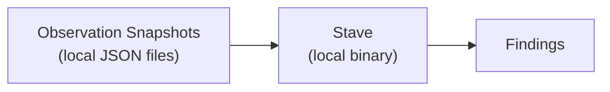

# Air-Gapped Analysis

Stave evaluates infrastructure safety without any network access, cloud credentials, or API calls.

## How It Works

Stave reads JSON observation snapshots that describe your infrastructure at a point in time. The entire evaluation happens locally on your machine — Stave never connects to any cloud API:

Stave never sees your cloud credentials. It never makes outbound network requests. It reads local files and writes local output.

To learn how to create observation snapshots from your infrastructure, see [Configuration Export](./03-configuration-export.md).

## Why This Matters

**Reduced attack surface.** Security tools that connect to cloud APIs need broad read permissions (often `ReadOnlyAccess` or similar). Those credentials become high-value targets. If the security tool is compromised, the attacker gets a map of your entire infrastructure. Stave eliminates this risk — there are no credentials to steal.

**Auditable inputs.** Every evaluation runs against a concrete set of JSON files that you control. You can inspect exactly what data Stave sees, version it in git, diff it between runs, and reproduce any evaluation deterministically. There are no hidden API calls or cached state.

**Works in restricted environments.** Air-gapped networks, FedRAMP environments, and networks with strict egress rules can run Stave without firewall exceptions or proxy configurations.

**Deterministic output.** Given the same input files and the `--eval-time` flag, Stave produces byte-identical output every time. This enables golden-file testing and makes it straightforward to validate that a code change didn't alter evaluation behavior.

## The Trade-Off

You are responsible for creating observation snapshots and keeping them current. Stave cannot detect changes that happen between snapshots. The [Configuration Export](./03-configuration-export.md) guide covers how to automate this using the AWS CLI, Terraform, or custom scripts.

For duration-based invariants, Stave needs at least two snapshots taken at different times to track how long a resource has been unsafe. A single snapshot can only detect current state — it cannot establish duration.
