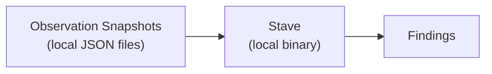

# Air-Gapped Operation

Stave evaluates infrastructure safety without network access, cloud credentials, or API calls. It reads local JSON snapshots and writes local output.



## Why This Matters

**Reduced attack surface.** Security tools that connect to cloud APIs need broad read permissions. Those credentials become high-value targets. Stave eliminates this risk — there are no credentials to steal.

**Auditable inputs.** Every evaluation runs against concrete JSON files you control. You can inspect what data Stave sees, version it in git, diff it between runs, and reproduce any evaluation deterministically.

**Works in restricted environments.** Air-gapped networks, FedRAMP environments, and networks with strict egress rules can run Stave without firewall exceptions or proxy configurations.

**Deterministic output.** Given the same input files and `--eval-time`, Stave produces byte-identical output every time.

## Runtime Guarantees

The `stave` binary:

- **No network access** — contains zero networking code; makes no HTTP requests, DNS lookups, or socket connections.
- **No subprocess execution** — never calls `os/exec` or shells out to external tools.
- **No credential access** — does not read AWS credentials, environment variables for cloud APIs, or key stores.
- **Local files only** — reads observation JSON and control YAML from disk, writes evaluation results to stdout.
- **Embedded schemas** — JSON Schemas are compiled into the binary via `//go:embed`; no download step at runtime.

You can verify this yourself:

```bash
# Confirm no net or os/exec imports in the runtime binary
go list -deps ./cmd/stave | grep -E '^net$|^net/http$|^os/exec$'
# Expected: no output
```

## What is in Scope for Air-Gapped Use

- Running the released `stave` binary
- Validating observations and controls
- Evaluating findings from local snapshots
- Diagnosing previous output with local inputs
- Logic trace audit trail (`--trace` writes a local JSON file)

## What Requires Network

These activities are outside runtime execution:

- Downloading dependencies while building from source
- CI workflows
- Release signing and attestation publication
- Uploading release artifacts

### Build-Time Network Dependencies

Building Stave from source requires network access:

| Dependency | Purpose | When |
|---|---|---|
| Go module proxy (`proxy.golang.org`) | Download Go dependencies | `go mod download` |
| GitHub Actions runners | CI pipeline execution | On push/PR |
| govulncheck DB (`vuln.go.dev`) | Known-vulnerability scanning | CI lint step |
| OpenSSF Scorecard | Supply-chain security scoring | Scheduled CI |
| Docker Hub / GHCR | Base images for demo container | `docker build` |
| Sigstore (`rekor.sigstore.dev`) | Keyless release signing | Release workflow |
| GitHub Releases API | Upload release archives | Release workflow |

For fully air-gapped builds, vendor dependencies first on a connected machine:

```bash
go mod vendor
# Then copy the repository (with vendor/) to the air-gapped host
GOFLAGS=-mod=vendor make build
```

### Test-Time Notes

- **Unit tests** (`make test`) — fully local, no network required.
- **E2E tests** (`make e2e` / `go test ./e2e/...`) — fully local, but require `jq`, `diff`, and `bash`.
- No test downloads fixtures or contacts external services.

### Release-Time Notes

Release signing and attestation require network access:

- **Sigstore cosign** — keyless signing via Fulcio CA and Rekor transparency log
- **SBOM generation** — Syft produces SPDX SBOMs locally; the release workflow uploads them
- **Build provenance** — GitHub-native SLSA attestation on release archives
- **Artifact upload** — release archives, checksums, and SBOMs are uploaded to GitHub Releases

## The Trade-Off

You are responsible for creating observation snapshots and keeping them current. Stave cannot detect changes that happen between snapshots. See [Create Observation Snapshots](../how-to/getting-started/create-snapshots.md) for automation patterns.

For duration-based controls, Stave needs at least two snapshots taken at different times to track how long a resource has been unsafe. A single snapshot can only detect current state.

## Operational Guidance

- Treat observation and output files as sensitive.
- Use `--sanitize` for shared outputs.
- Prefer deterministic runs in CI with `--eval-time`.

## FAQ

### Why do the ACL constants contain `http://` URLs?

The constants `GroupURIAllUsers` and `GroupURIAuthenticatedUsers` in
`internal/platform/providers/aws/s3/acl/facts.go` contain URIs like
`http://acs.amazonaws.com/groups/global/AllUsers`. These are **opaque
identifiers defined by the AWS S3 ACL specification** — string
comparisons, not HTTP endpoints. Stave never fetches these URLs.

See: [AWS ACL grantee documentation](https://docs.aws.amazon.com/AmazonS3/latest/userguide/acl-overview.html#specifying-grantee)

### What are the `urn:stave:schema:...` identifiers?

The JSON Schema specification requires `$id` to be a URI. Stave uses URN-scheme
identifiers (e.g. `urn:stave:schema:obs.v0.1`) as **in-memory identifiers** for
the schema compiler. Schemas are loaded from embedded files (`//go:embed`), never
fetched over the network. The URN scheme was chosen to avoid
false positives from security scanners looking for HTTP endpoints.

### Does `genrecordings` make network calls?

No. `cmd/genrecordings` is a developer-only build tool that uses `os/exec` to run
the local `stave` binary and capture terminal recordings. It makes no network
connections.

## Related Docs

- [Execution Safety](execution-safety.md)
- [Data Flow and I/O](data-flow.md)
- [Release Security](release-security.md)
- [Sanitization and Scrubbing](../how-to/results/sanitization.md)
