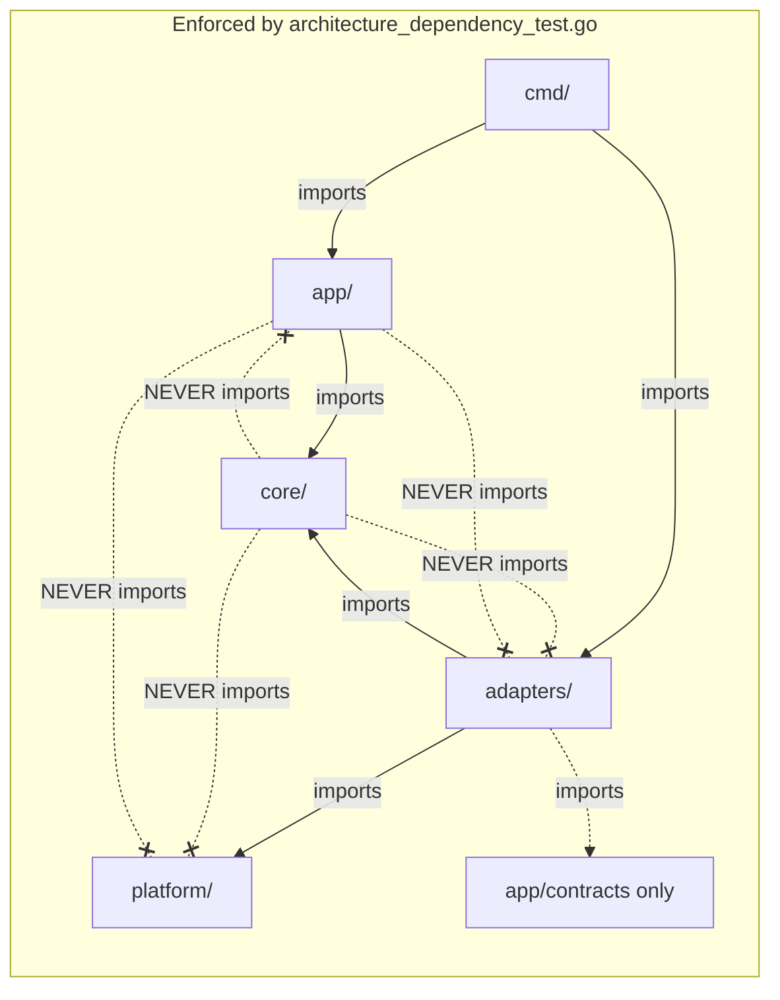
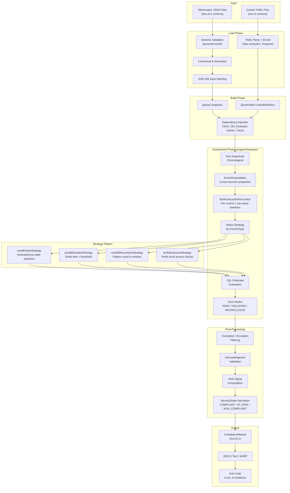
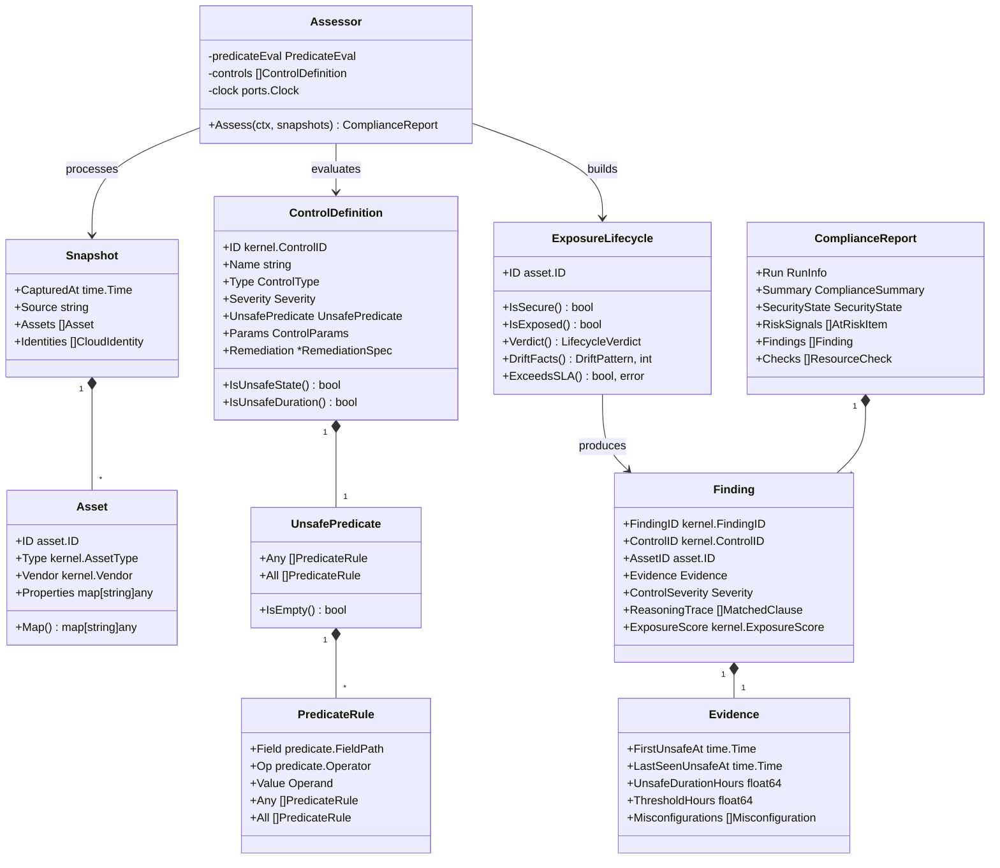
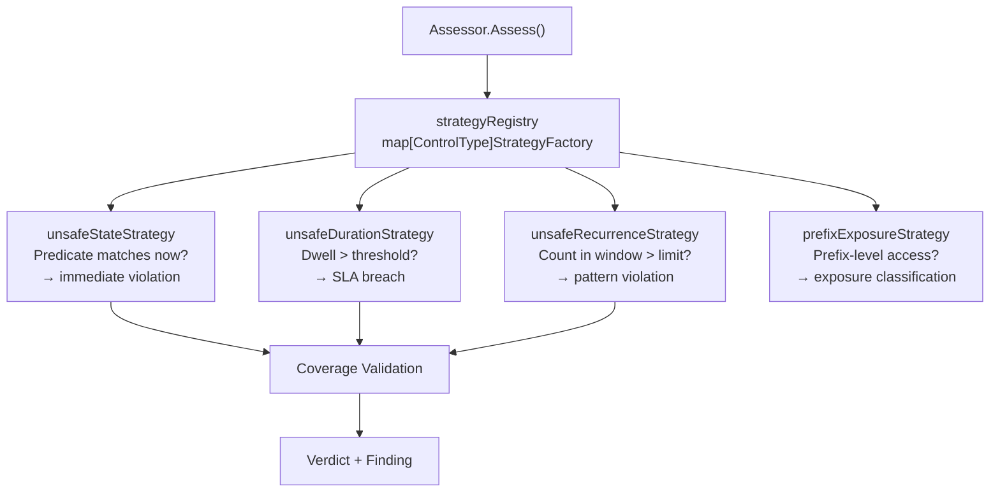
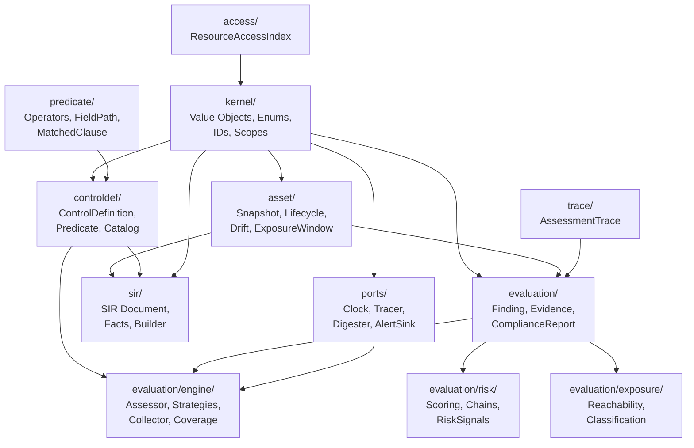

The four-layer model and how it was discovered.

---

## The Layers Were Found, Not Designed

Stave was not designed top-down from an architecture diagram. It grew from a single capability — evaluating security predicates against JSON snapshots — and each layer emerged when the layer below became insufficient.

### Layer 1: Data (Observations + Controls)

The foundation. JSON snapshots describe infrastructure state. YAML controls define what must be true. The CEL evaluation engine connects them. This layer answers: "is this asset compliant with this control?"

This was Stave for the first several months. It worked. Then the question changed.

### Layer 2: Evaluation (Assessment Engine)

One control evaluating one asset is useful. Six hundred controls evaluating eight hundred assets across two time points requires an engine that handles lifecycle tracking, temporal reasoning, SLA annotation, and deterministic output.

This layer emerged because the data layer could not answer "how long has this asset been non-compliant?" or "did this violation exist yesterday?" These are temporal questions that require maintaining state across snapshots.

### Layer 3: Analytical (Risk Reasoning)

Individual findings are necessary but not sufficient. The question became "which of these 84 findings should we fix first?" and "do these three findings together create a worse situation than each alone?"

This layer added: posture scoring, compound chains, attack path graphs, blast radius computation, and remediation ranking. These are analytical operations on the evaluation layer's output — they do not evaluate predicates themselves.

### Layer 4: Executive (Reporting + Governance)

The analytical layer produces data. The executive layer produces documents — reports, plans, comparisons, trend analyses, and evidence archives. The audience is no longer a security engineer looking at findings. It is a CISO presenting to a board, a compliance officer preparing an audit package, or a team lead routing remediation work.

## The OSI Analogy

This layering resembles OSI — each layer consumes the layer below and provides abstractions for the layer above. The difference: the threat model is embedded in the architecture rather than threat-agnostic.

In OSI, Layer 3 (Network) routes packets without caring whether the payload is malicious. In Stave, Layer 3 (Analytical) computes risk *because* the evaluation layer identified violations. Each layer exists specifically to reason about security — there is no general-purpose data processing here.

## Why This Matters

The layering explains why Stave has 30+ commands that appear unrelated. They are not unrelated — they operate at different layers:

| Layer | Commands |
|-------|----------|
| Data | `apply`, `validate`, `diagnose` |
| Evaluation | `apply` (assessment mode), `bisect`, `forensics` |
| Analytical | `score`, `rank`, `map`, `path`, `coverage` |
| Executive | `report`, `plan`, `compare`, `trend`, `budget`, `monitor`, `verify` |

## Structural Reference

The four-layer model above describes *why* the system is shaped the way
it is. The diagrams below describe *how* that shape maps onto the Go
package structure (hexagonal architecture: `cmd → app → core`,
`adapters → core/platform`, with `core` depending on nothing outward).

### System Overview

```mermaid
graph TB
    subgraph External["External Interfaces"]
        CLI["stave CLI<br/>(Cobra)"]
        MCP["stave-mcp<br/>(JSON-RPC 2.0 / MCP Server)"]
        PkgAPI["pkg/stave<br/>(Go Public API)"]
    end

    subgraph CMD["cmd/ — CLI Boundary"]
        Commands["Commands<br/>apply, validate, diagnose,<br/>enforce, watch, bisect,<br/>trend, compare, export-sir,<br/>+ 70 more"]
        Bootstrap["bootstrap.go<br/>Config, Logger, Sanitizer"]
        Executor["executor.go<br/>Signal handling, Exit codes"]
    end

    subgraph APP["internal/app/ — Use Cases"]
        Eval["eval/<br/>AuditWorkflow"]
        Fix["fix/<br/>RemediationImpact"]
        Watch["watch/<br/>ContinuousMonitor"]
        Bisect["bisect/<br/>BinarySearch"]
        Gate["gate/<br/>CI Enforcement"]
        Trend["trend/<br/>PostureAnalysis"]
        AppMore["+ 80 more use cases"]
        Contracts["contracts/<br/>Port Interfaces"]
    end

    subgraph ADAPTERS["internal/adapters/ — Infrastructure"]
        ObsLoader["observations/<br/>JSON Loader + Schema Validation"]
        CtlLoader["controls/yaml/<br/>YAML Loader + Enrichment"]
        CEL["cel/<br/>Compiler + Evaluator"]
        Output["output/<br/>JSON, Text, SARIF Formatters"]
        SIRBridge["sirbridge/<br/>SIR Document Builder"]
        Graph["graph/<br/>Attack Path Export"]
        AWS["aws/<br/>S3 Resolver"]
        AdaptMore["alert, baseline, evidence,<br/>integrity, sla, telemetry, ..."]
    end

    subgraph CORE["internal/core/ — Domain (zero external deps)"]
        Kernel["kernel/<br/>Value Objects &amp; Enums"]
        Asset["asset/<br/>Snapshot, Lifecycle, Drift"]
        ControlDef["controldef/<br/>ControlDefinition, Predicate"]
        EvalPkg["evaluation/<br/>Finding, Evidence, Verdict"]
        Engine["evaluation/engine/<br/>Assessor + Strategies"]
        SIR["sir/<br/>SIR Types &amp; Builder"]
        Risk["evaluation/risk/<br/>Scoring, Chains, Signals"]
        Exposure["evaluation/exposure/<br/>Reachability Classification"]
        Ports["ports/<br/>Clock, Tracer, Digester"]
        CoreMore["access, predicate, trace,<br/>compliance, evidence, report, ..."]
    end

    subgraph PLATFORM["internal/platform/ — OS & Provider"]
        Crypto["crypto/<br/>SHA-256, HMAC"]
        FSUtil["fsutil/<br/>File I/O"]
        Logging["logging/<br/>slog Setup"]
        Providers["providers/aws/<br/>S3 Policy, ACL, IAM Analysis"]
    end

    CLI --> Commands
    MCP --> PkgAPI
    PkgAPI --> APP
    Commands --> Bootstrap
    Bootstrap --> Executor
    Commands --> APP

    APP --> Contracts
    Contracts -.->|implements| ADAPTERS
    APP --> CORE

    ADAPTERS --> CORE
    ADAPTERS --> PLATFORM

    Engine --> Ports
    Ports -.->|implements| CEL
    Ports -.->|implements| Crypto
```



### Hexagonal Architecture (Dependency Rules)



### Evaluation Data Flow



### Core Domain Model



### SIR Export Pipeline

```mermaid
flowchart LR
    subgraph Stave["Stave (Librarian)"]
        Apply["stave apply<br/>CEL Evaluation"]
        ExportSIR["stave export-sir"]
        SIRBuilder["sir.Builder<br/>(core/sir/)"]
        Bridge["sirbridge/<br/>AWS Policy → Facts"]
    end

    subgraph SIRDoc["SIR Document"]
        Controls["ControlFact[]<br/>ID, Predicate AST, Threshold"]
        Assets["AssetFact[]<br/>ID, Type, Properties"]
        Identities["IdentityFact[]<br/>Principal, ValidityWindows,<br/>RoleChains"]
        ResGroups["ResourceFactGroup[]<br/>BucketPolicy, ACL, PAB, IAM"]
        Temporal["TemporalFacts<br/>Observations[], ExposureWindows[]"]
    end

    subgraph Solver["External Solver (Judge)"]
        Z3["Z3 SAT Solver<br/>(experiments/z3-solver/)"]
        Queries["Queries:<br/>reachability, conflict,<br/>invariant, choke-point"]
    end

    ExportSIR --> SIRBuilder
    SIRBuilder --> Bridge
    Bridge --> SIRDoc
    SIRDoc --> Z3
    Z3 --> Queries

    Apply -.->|same input data| ExportSIR
```



### MCP Server Architecture

```mermaid
flowchart LR
    Agent["AI Agent<br/>(Claude Code, Cursor)"]
    MCP["stave-mcp<br/>(JSON-RPC 2.0 over stdio)"]
    PkgStave["pkg/stave.Apply()"]
    Core["Evaluation Engine"]

    Agent -->|"initialize<br/>tools/list<br/>tools/call"| MCP
    MCP -->|"stave.verify<br/>stave.explain<br/>stave.suggest_fix"| PkgStave
    PkgStave --> Core
    Core -->|Assessment JSON| PkgStave
    PkgStave -->|MCP content[]| MCP
    MCP -->|JSON-RPC response| Agent
```

### Evaluation Strategy Pattern



### Package Dependency Graph (Core)


